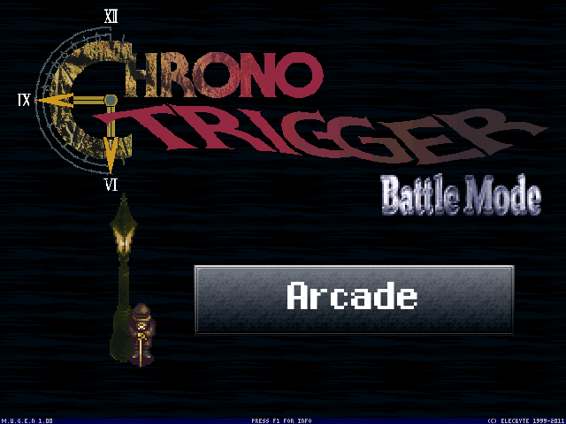
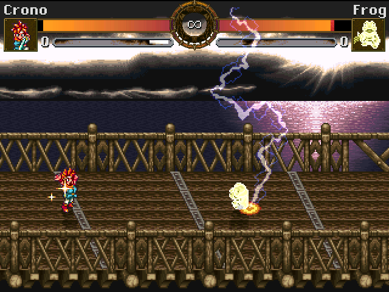
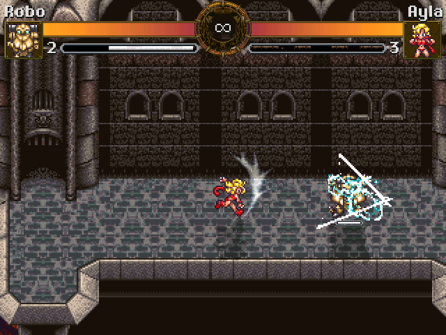
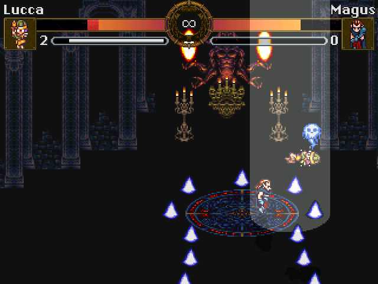

# CTM — Chrono Trigger MUGEN

A fan-made 2D fighting game adaptation of Chrono Trigger, built on the MUGEN engine.
You play as one of the game's main characters (Crono, Marle, Lucca, Frog, Robo,
Ayla or Magus), and face other characters and bosses.

## About

Chrono Trigger is a 2D JRPG made by what was called a "Dream Team". It's one of my
favorite games.

I started playing with MUGEN around 2004, and started learning how to create characters. I worked on and off on this roughly from 2007 to 2014, very sporadically. Then I learned git dug up this, and started versioning it properly. Each character has its own repo as a submodule. This is not a MUGEN convention as far as I know, but I wanted to keep things organized.

## Characters

Each character has its separate project page.

-  [![Crono][crono] Crono](http://jbahamon.github.io/ctm-crono/), the silent protagonist.

- [![Marle][marle] Marle](http://jbahamon.github.io/ctm-marle/), the energetic princess.

- [![Lucca][lucca] Lucca](http://jbahamon.github.io/ctm-lucca/), childhood friend and mechanical genius.

- [![Frog][frog] Frog](http://jbahamon.github.io/ctm-frog/), the chivalrous amphibious knight.

- [![Robo][robo] Robo](http://jbahamon.github.io/ctm-robo/), repaired automaton from a doomed future.

- [![Ayla][ayla] Ayla](http://jbahamon.github.io/ctm-ayla/), the tough leader of the Ioka village.

- [![Magus][magus] Magus](http://jbahamon.github.io/ctm-magus/), the Fiendlord with a dark past.

## Screenshots

The title screen

Includes characters, stages, lifebars and more.

Each character has their own special and supermoves based on the original game.

Some elements are interpreted to be in a less top-down view.

## How to play

CTM is based, as the name suggests, on the
[MUGEN](https://en.wikipedia.org/wiki/M.U.G.E.N) fighting game engine, which is included in the repo. You just download the repo and run the `mugen/mugen.exe` file to launch the game.

### Music

The code for background music is already there (including appropriate loop points). However, the game's music is not included to avoid blatant copyright issues. 

If you happen to have Chrono Trigger's OST as mp3 files, include the following songs (with these exact names) in the `mugen/docs` folder.

- Battle 1.mp3 (originally "Battle") 
- Battle 2.mp3
- Battle With Magus.mp3
- Black Dream.mp3
- Boss Battle.mp3
- Boss Battle 2.mp3
- Confusing Melody.mp3
- Critical Moment.mp3 (also known as "A Shot of Crisis")
- Fanfare 1.mp3
- The Brink of Time.mp3
- The Trial.mp3
- Tyranno Lair.mp3
- Undersea Palace.mp3
- Wings That Cross Time.mp3
- World Revolution.mp3

## Credits, Acknowledgments, Legal

Use my code for whatever you want. Chrono Trigger, its setting, and all of its characters are property of Square-Enix. This creation/adaptation was made for entertainment, not for profit. If you want to host this, modify or use it for your own purposes, try to contact me first.
 
Thanks to:

- My friends and family, for supporting me all this time.

- [The Spriters Resource](http://www.spriters-resource.com) for the sprites. Rips by Tonberry2k, Nemu, Dazz
  and many others were incredibly useful.

- [The Chrono Compendium](http://chronocompendium.com). In particular, the user Dirtie ripped 
  a ton of Chrono Trigger sound effect and made them available to everyone.

- The guys at the [Mugen Fighters Guild Forum](http://mugenguild.com/forumx/index.php),
  for answering my questions and helping me learn. Their Code Library/Snippet Section rocks.

- So many MUGEN creators: PoTS, SMEE, Bia, warusaki3 and everyone who creates stuff that others can use.

- Square (now Square-Enix) and the team that created Chrono Trigger.

- Elecbyte, of course, for creating the awesome fighting game engine that is MUGEN.

- And you...

[crono]: docs/img/crono.gif "Crono"
[marle]: docs/img/marle.gif "Marle"
[lucca]: docs/img/lucca.gif "Lucca"
[frog]:  docs/img/frog.gif  "Frog"
[robo]:  docs/img/robo.gif  "Robo"
[ayla]:  docs/img/ayla.gif  "Ayla"
[magus]: docs/img/magus.gif "Magus"
